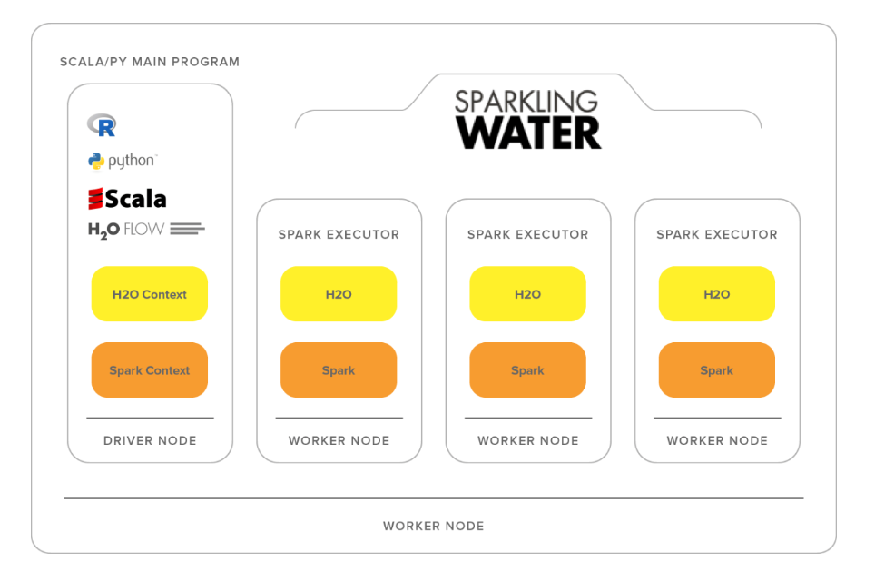

# 集成模型

<!-- @import "[TOC]" {cmd="toc" depthFrom=1 depthTo=6 orderedList=false} -->

<!-- code_chunk_output -->

- [集成模型](#集成模型)
  - [平台应用](#平台应用)
    - [H2O.ai](#h2oaihttpsh2oaiplatformh2o-automl)
  - [工具](#工具)

<!-- /code_chunk_output -->

## 平台应用
本部分主要介绍各个AutoML平台是否以及如何提供对集成模型的支持。
### [H2O.ai](https://h2o.ai/platform/h2o-automl/)
- [Developer guide](https://docs.h2o.ai/h2o/latest-stable/h2o-docs/welcome.html), [stacked ensembles](https://docs.h2o.ai/h2o/latest-stable/h2o-docs/data-science/stacked-ensembles.html)
- 什么是H20.ai
    

    > H20是一个分布式开源机器学习平台，开发语言为Java，基于Map/Reduce分布式框架与Java Fork/Join并行执行任务框架。H20项目中的Sparkling water提供H20在SPARK上的服务。H20支持有监督学习与无监督学习。
- Stacked ensemble

   

## 工具
- [Auto-sklearn](https://automl.github.io/auto-sklearn/master/)
