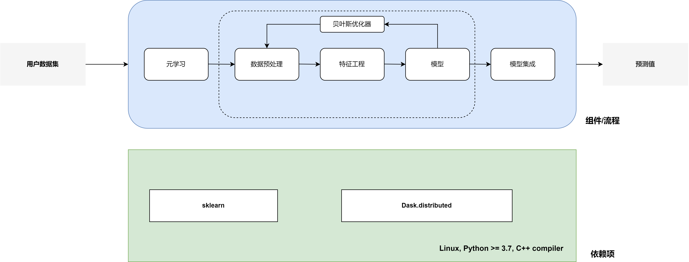
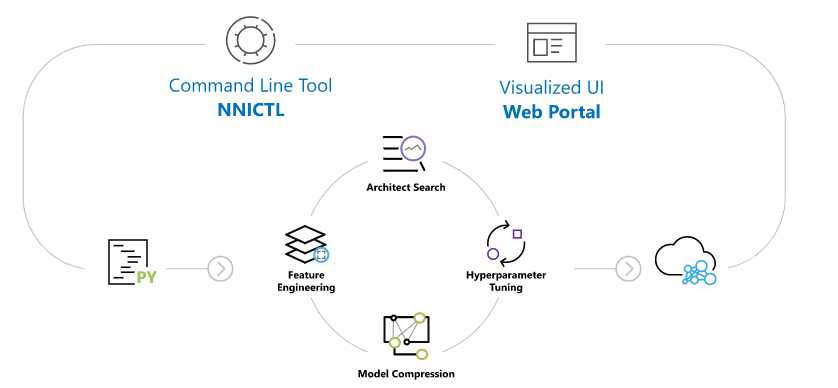

# 自动化算法的实现


<!-- @import "[TOC]" {cmd="toc" depthFrom=1 depthTo=6 orderedList=false} -->

<!-- code_chunk_output -->

- [自动化算法的实现](#自动化算法的实现)
  - [介绍](#介绍)
  - [AutoSklearn](#autosklearn)
    - [工程化](#工程化)
    - [算法实现](#算法实现)
      - [支持元学习](#支持元学习)
      - [不支持神经网络架构搜索](#不支持神经网络架构搜索)
      - [支持模型集成](#支持模型集成)
  - [Microsoft NNI](#microsoft-nnihttpsgithubcommicrosoftnni)
    - [工程化](#工程化-1)
    - [算法实现](#算法实现-1)
      - [神经网络架构搜索](#神经网络架构搜索)
    - [Demo](#demo)
  - [H20](#h20)
  - [参考资料](#参考资料)

<!-- /code_chunk_output -->


## 介绍

本部分主要介绍了主流自动化机器学习平台或开源工具对自动化算法的支持，重点对开源工具的编程语言，依赖项，运行平台，是否对算法进行优化进行分析。


## AutoSklearn


### 工程化
- 编程语言：Python；
- 系统要求：Linux，Python >= 3.7，C++ compiler (with C++ 11)；
- 支持的机器/深度学习框架：scikit-learn；
- 是否支持分布式训练：支持，基于dask, [example](https://automl.github.io/auto-sklearn/master/examples/60_search/example_parallel_manual_spawning_cli.html#sphx-glr-examples-60-search-example-parallel-manual-spawning-cli-py)；
- 可扩展性：不支持扩展非基于scikit-learn的模型
- 资源需求：共享文件中的数据（包括训练数据与模型）来实现并行计算，同时，用户需要**手动设定AutoSklearn的内存与运行时间限制**，一般情况下，内存一般设置在3GB到6GB，时间限制在一天内，一个模型的运行时间一般限制在30分钟，[link](https://automl.github.io/auto-sklearn/master/faq.html)。
- GUI或CLI：均不提供。
### 算法实现
用户可以对自动化机器学习流程中的步骤进行自定义设置，包括：
- 可以自定义是否需要数据预处理，[link](https://automl.github.io/auto-sklearn/master/examples/80_extending/example_extending_data_preprocessor.html#sphx-glr-examples-80-extending-example-extending-data-preprocessor-py)
- 可以自定义是否需要特征工程；
- 可以自定义模型搜索空间；
  ```python
  import autosklearn.classification
  automl = autosklearn.classification.AutoSklearnClassifier(
    include = {
        'classifier': ["random_forest"], # user define the model search space
        'feature_preprocessor': ["no_preprocessing"]
    },
    exclude=None
  )
  automl.fit(X_train, y_train)
  predictions = automl.predict(X_test)
  ```
  - 支持的分类模型（16种）
    - adaboost
    - bernoulli_nb
    - decision_tree
    - extra_trees
    - gaussian_nb
    - gradient_boosting
    - k_nearest_neighbors
    - lda
    - liblinear_svc
    - libsvm_svc
    - mlp
    - multinomial_nb
    - passive_aggressive
    - qda
    - random_forest
    - sgd
  - 回归模型（10种）
    - adaboost
    - ard_regression
    - decision_tree
    - extra_trees
    - gaussian_process
    - gradient_boosting
    - k_nearest_neighbors
    - libsvm_svr
    - mlp
    - random_forest
- 可以自定义模型选择标准
- AutoSklearn 机器学习源代码在`auto-sklearn/autosklearn/pipeline`中
#### 支持元学习 
- 支持OpenML中的数据集，[link](https://github.com/automl/auto-sklearn/blob/master/scripts/update_metadata_util.py)
- 源代码
  ```python
  # -*- encoding: utf-8 -*-

  import time

  from autosklearn.constants import (
      MULTICLASS_CLASSIFICATION,
      MULTILABEL_CLASSIFICATION,
      TASK_TYPES_TO_STRING,
  )
  from autosklearn.metalearning.optimizers.metalearn_optimizer.metalearner import (
      MetaLearningOptimizer,
  )


  def suggest_via_metalearning(
      meta_base, dataset_name, metric, task, sparse, num_initial_configurations, logger
  ):

      if task == MULTILABEL_CLASSIFICATION:
          task = MULTICLASS_CLASSIFICATION

      task = TASK_TYPES_TO_STRING[task]

      logger.info(task)

      start = time.time()
      ml = MetaLearningOptimizer(
          dataset_name=dataset_name,
          configuration_space=meta_base.configuration_space,
          meta_base=meta_base,
          distance="l1",
          seed=1,
          logger=logger,
      )
      logger.info("Reading meta-data took %5.2f seconds", time.time() - start)
      runs = ml.metalearning_suggest_all(exclude_double_configurations=True)
      return runs[:num_initial_configurations]
  ```


#### 不支持神经网络架构搜索
#### 支持模型集成 
- 基于`Ensemble selection`方法；
- 用户可以定义集成模型的最多模型个数；
- 用户可以定义硬盘上保存的最多模型个数；
- 源代码 (ensemble_selection的基类)
  ```python
  from __future__ import annotations

  from abc import ABC, abstractmethod
  from typing import Any, Dict, List, Sequence, Tuple, Union

  import numpy as np

  from autosklearn.automl_common.common.utils.backend import Backend
  from autosklearn.data.validation import SUPPORTED_FEAT_TYPES
  from autosklearn.ensemble_building.run import Run
  from autosklearn.metrics import Scorer
  from autosklearn.pipeline.base import BasePipeline


  class AbstractEnsemble(ABC):
      @abstractmethod
      def __init__(
          self,
          task_type: int,
          metrics: Sequence[Scorer] | Scorer,
          backend: Backend,
          random_state: int | np.random.RandomState | None = None,
      ):
          pass

      def __getstate__(self) -> Dict[str, Any]:
          # Cannot serialize a metric if
          # it is user defined.
          # That is, if doing pickle dump
          # the metric won't be the same as the
          # one in __main__. we don't use the metric
          # in the EnsembleSelection so this should
          # be fine
          return {key: value for key, value in self.__dict__.items() if key != "metrics"}

      @abstractmethod
      def fit(
          self,
          base_models_predictions: np.ndarray | List[np.ndarray],
          true_targets: np.ndarray,
          model_identifiers: List[Tuple[int, int, float]],
          runs: Sequence[Run],
          X_data: SUPPORTED_FEAT_TYPES | None = None,
      ) -> "AbstractEnsemble":
          """Fit an ensemble given predictions of base models and targets.

          Ensemble building maximizes performance (in contrast to
          hyperparameter optimization)!

          Parameters
          ----------
          base_models_predictions: np.ndarray
              shape = (n_base_models, n_data_points, n_targets)
              n_targets is the number of classes in case of classification,
              n_targets is 0 or 1 in case of regression

              Can be a list of 2d numpy arrays as well to prevent copying all
              predictions into a single, large numpy array.

          X_data : list-like or sparse data

          true_targets : array of shape [n_targets]

          model_identifiers : identifier for each base model.
              Can be used for practical text output of the ensemble.

          runs: Sequence[Run]
              Additional information for each run executed by SMAC that was
              considered by the ensemble builder.

          Returns
          -------
          self

          """
          pass

      @abstractmethod
      def predict(
          self, base_models_predictions: Union[np.ndarray, List[np.ndarray]]
      ) -> np.ndarray:
          """Create ensemble predictions from the base model predictions.

          Parameters
          ----------
          base_models_predictions : np.ndarray
              shape = (n_base_models, n_data_points, n_targets)
              Same as in the fit method.

          Returns
          -------
          np.ndarray
          """
          pass

      @abstractmethod
      def get_models_with_weights(
          self, models: Dict[Tuple[int, int, float], BasePipeline]
      ) -> List[Tuple[float, BasePipeline]]:
          """List of (weight, model) pairs for all models included in the ensemble.

          Parameters
          ----------
          models : dict {identifier : model object}
              The identifiers are the same as the one presented to the fit()
              method. Models can be used for nice printing.

          Returns
          -------
          List[Tuple[float, BasePipeline]]
          """

      @abstractmethod
      def get_identifiers_with_weights(
          self,
      ) -> List[Tuple[Tuple[int, int, float], float]]:
          """Return a (identifier, weight)-pairs for all models that were passed to the
          ensemble builder.

          Parameters
          ----------
          models : dict {identifier : model object}
              The identifiers are the same as the one presented to the fit()
              method. Models can be used for nice printing.

          Returns
          -------
          List[Tuple[Tuple[int, int, float], float]
          """

      @abstractmethod
      def get_selected_model_identifiers(self) -> List[Tuple[int, int, float]]:
          """Return identifiers of models in the ensemble.

          This includes models which have a weight of zero!

          Returns
          -------
          list
          """

      @abstractmethod
      def get_validation_performance(self) -> float:
          """Return validation performance of ensemble.

          Returns
          -------
          float
          """


  class AbstractMultiObjectiveEnsemble(AbstractEnsemble):
      @property
      @abstractmethod
      def pareto_set(self) -> Sequence[AbstractEnsemble]:
          """Get a sequence on ensembles that are on the pareto front

          Raises
          ------
          SklearnNotFittedError
              If ``fit`` has not been called and the pareto set does not exist yet

          Returns
          -------
          Sequence[AbstractEnsemble]
          """
          ...

  ```


## [Microsoft NNI](https://github.com/microsoft/nni) 



### 工程化
- 编程语言：Python；
- 系统要求：Linux（Ubuntu >= 18.04）或者Windows 10（Windows >= 21H2）或者Mac（Mac >= 11），Python >= 3.7 ；
- 支持的机器/深度学习框架：PyTorch，TensorFlow，Scikit-learn，XGBoost，LightGBM，MXNet，Caffe2；
- 是否支持分布式训练：支持，NNI支持本地以及多种远程训练服务平台，包括远程SSH服务器，Azure机器学习平台，基于K8s的OpenAPI，Kubeflow，FrameworkController，AdaptDL，PAI DLC，以及混合训练，可通过`TrainingServiceConfig`来设置用户期望的训练服务平台，[link](https://nni.readthedocs.io/zh/stable/reference/experiment_config.html#trainingserviceconfig)；
- 可扩展性：可扩展，用户可扩展超参调优模块中的tuner，assessors，以及advisors，用户可扩展NAS模块中搜索策略。
- 资源需求：可以通过挂载NFS或Azure Blob设置共享文件夹。
-  GUI或CLI：提供CLI与GUI。具体功能如下：
    - 基于nnictl的CLI可以控制实验，比如启动停止实验，启动停止WebUI；
    - 集成Tensorboard的WebUI，用户可以在上面观察NNI实验训练过程、详细的metrics以及实验的log和error。 当然，用户可以管理实验，调制 trials 比如修改实验的concurrency值，时长以及重跑一些trials，[link](https://nni.readthedocs.io/zh/stable/experiment/web_portal/web_portal.html)。

### 算法实现
nni主要支持多种神经网络结构搜索算法。
- 支持超参数调优；
- 支持神经网络结构搜索；
- 支持特征工程；
- 支持模型压缩；

#### 神经网络架构搜索
nni神经网络架构搜索基于`retiarri`, 支持多种搜索策略（强化学习算法，进化算法，梯度下降算法（darts）等）


### Demo
- [手写体数字识别任务的神经网络架构搜索](https://git.iflytek.com/hangji/automlresearch/-/blob/master/Demo/NAS/hello_nas.ipynb)
- [基于DARTS的神经网络架构搜索](https://git.iflytek.com/hangji/automlresearch/-/blob/master/Demo/NAS/darts.ipynb)


## H20


## 参考资料
- [AutoML框架概览](https://zhuanlan.zhihu.com/p/378722852)
- 


