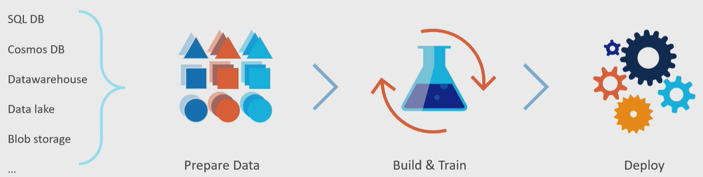
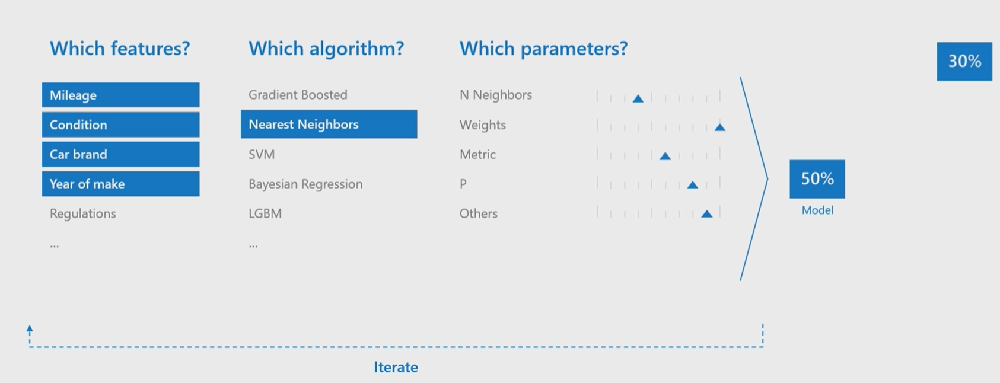

# autoMLresearch

<!-- @import "[TOC]" {cmd="toc" depthFrom=1 depthTo=6 orderedList=false} -->

<!-- code_chunk_output -->

- [autoMLresearch](#automlresearch)
  - [自动化算法](#自动化算法)
    - [介绍](#介绍)
      - [自动化算法相关](#自动化算法相关)
    - [元学习（Meta-learning）](#元学习meta-learning)
      - [基本原理](#基本原理)
    - [集成模型 (Ensemble selection)](#集成模型-ensemble-selection)
      - [基本原理](#基本原理-1)
    - [神经架构搜索（Neural architecture search NAS）](#神经架构搜索neural-architecture-search-nas)
      - [基本原理](#基本原理-2)
    - [迁移学习（Transfer learning）](#迁移学习transfer-learning)
      - [基本原理](#基本原理-3)
    - [其他自动化算法相关](#其他自动化算法相关)
    - [自动化算法的实现](#自动化算法的实现)
    - [初步结论](#初步结论)
    - [参考资料](#参考资料)

<!-- /code_chunk_output -->

## 自动化算法

### 介绍

传统的机器学习流程包括准备数据，搭建与训练模型，部署模型；在这一流程的各个阶段中，有各个设置需要开发人员依次迭代，已得到最终表现最佳的机器学习模型，例如，在预测汽车价格中，在准备数据阶段，需要开发人员定义哪些特征是需要保留的，在模型搭建与训练阶段，需要开发人员选择合适的算法与适当的参数。这一个过程通常耗费时间与人力。自动化机器学习可以利用**机器学习**的方法，对不同阶段的设置进行选择与进行迭代，例如，自动化特征工程，自动化超参数设置，减少人工的成本与运算的资源，提供高效的机器学习解决方法。

#### 自动化算法相关
在本部分主要关注如何利用机器学习的方法，选择相关的模型，主要包括以下场景：
- **模型训练前**，根据输入数据集选择合适的模型，在此场景中，主要利用元学习方法（Meta learning）对后续训练进行热启动；
- **模型训练阶段**，在利用深度学习模型的问题中，利用神经网络结构搜索（NAS）设计出性能最佳的神经网络模型；在利用机器学习模型的问题中，利用格点搜索，贝叶斯优化等方法优化得到合适的机器学习模型；
- **在模型训练后**，集成多个模型，主要有堆叠集成（Stacking or Super learner），集成选择方法（Ensemble selection）

同时，自动化算法的设计需要考虑算法的时间空间复杂度，以及是否有较好的泛化能力。

本报告主要介绍了**元学习**（meta learning），**神经网络结构搜索**（NAS），**集成学习**（Ensemble learning）的基本原理，简单分析了不同方法的时间与空间复杂度，在新数据集上的泛化能力，并分析了主流自动化机器学习工具对自动化算法的支持。

### 元学习（Meta-learning）
#### 基本原理
[元学习基本原理](https://git.iflytek.com/hangji/automlresearch/-/blob/master/Theory/metalearning.md)

### 集成模型 (Ensemble selection)
#### 基本原理

[集成学习原理](https://git.iflytek.com/hangji/automlresearch/-/blob/master/Theory/ensemble_selection.md)

### 神经架构搜索（Neural architecture search NAS）
#### 基本原理
[神经架构搜索](https://git.iflytek.com/hangji/automlresearch/-/blob/master/Theory/NAS.md)

### 迁移学习（Transfer learning）
#### 基本原理

### 其他自动化算法相关
- 自动化优化器选择
- 自动化激活函数
- 自动化Dropout

### 自动化算法的实现
[自动化算法的实现](https://git.iflytek.com/hangji/automlresearch/-/blob/master/Implementations/Implementations.md)

### 初步结论

### 参考资料

- [什么是AutoML](https://www.microsoft.com/zh-cn/videoplayer/embed/RE2Xc9t?postJsllMsg=true&autoCaptions=zh-cn)
- [ICML AutoML workshop](https://slideslive.com/icml-2020/7th-icml-workshop-on-automated-machine-learning-automl-2020)
- [走马观花AutoML](https://zhuanlan.zhihu.com/p/212512984)

