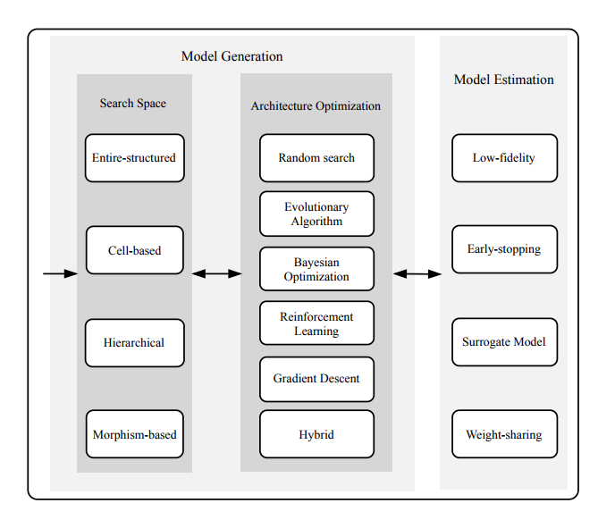
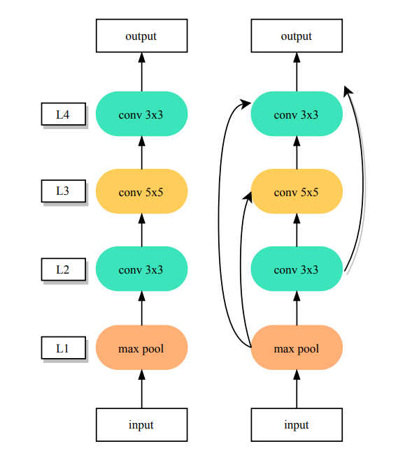
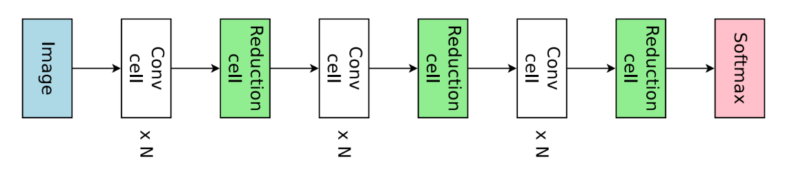
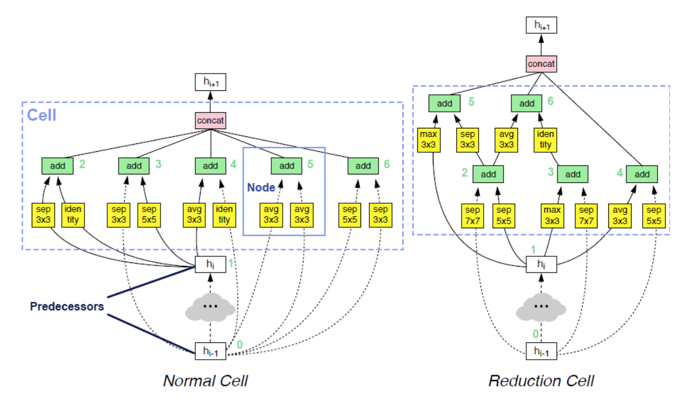
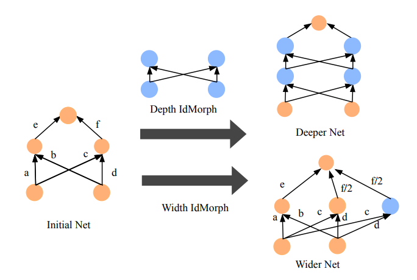
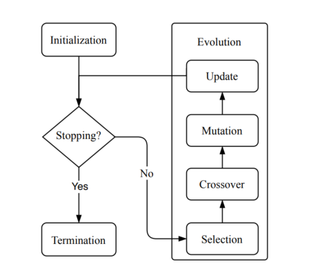
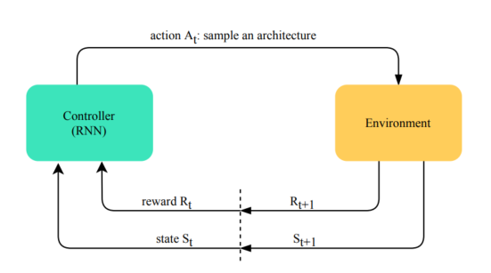
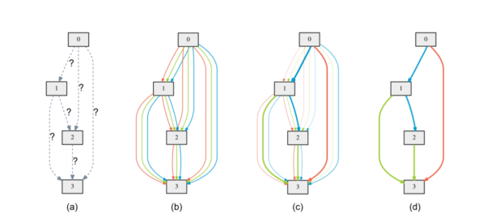

# 神经网络架构搜索


<!-- @import "[TOC]" {cmd="toc" depthFrom=1 depthTo=6 orderedList=false} -->

<!-- code_chunk_output -->

- [神经网络架构搜索](#神经网络架构搜索)
  - [基本原理](#基本原理)
    - [定义搜索空间（Predefined search space）](#定义搜索空间predefined-search-space)
    - [如何进行搜索](#如何进行搜索)
      - [进化算法](#进化算法)
      - [强化学习](#强化学习)
      - [梯度下降](#梯度下降)
    - [主流神经网络框架搜索算法介绍](#主流神经网络框架搜索算法介绍)
      - [DARTS](#dartshttpsarxivorgabs180609055)
      - [ENAS](#enashttpsarxivorgabs180203268)
    - [参考资料](#参考资料)

<!-- /code_chunk_output -->

## 基本原理

神经网络架构搜索是在**定义的搜索空间**，**利用一定的优化方法**，搜索到特定的网络结构，基于此结构的模型可以在目标任务中取得良好的表现。神经网络搜索的基本流程包括定义搜索空间（search space），基于搜索空间的结构优化（architecture optimization），以及模型评估（model evaluation）。




### 定义搜索空间（Predefined search space）

- **全结构网络搜索空间（Entire structured search space）**
将待搜索的网络结构抽象为有向无环图，节点代表特征张量，边代表运算操作，例如卷积运算，池化运算等。



对于某一个节点的计算如下：
```math
Z_k = \sum_{i=1}^{N_k}o_i(I_i), o_i \in O 
```
$N_k$代表节点的入度，$I_i$代表输入张量，$o_i$代表待选运算操作。

对于全结构网络搜索，时间空间复杂度高，并且最后搜索得到的网络结构迁移能力差。

- **基于元胞的搜索空间（cell-based search space）**
大多数的神经网络结构设计采取了多个相同的子结构，比如在ResNet及其变体中，堆叠了多个BottleNeck层。所以可以定义基于模型子结构（即元胞）的搜索空间，得到最佳子结构，再对子结构进行堆叠来得到最终最优模型结构, 如下图所示。




如上图，cell的结构通常包括两种，包括normal cell与reduction cell。normal cell与reduction cell的区别在于，reduction cell会对输入特征图进行下采样。同时，在cell中包括不同的节点（node），每个节点代表不同的运算操作。例如，在上图中包括以下运算操作：
```
  - Max pooling 3x3
  - Average pooling 3x3
  - Skip connect (Identity)
  - Separable convolution 3x3
  - Separable convolution 5x5
  - Dilated convolution 3x3
  - Dilated convolution 5x5
```
由于模型的搜索空间是基于cell的，当normal cell与reduction cell的结构确定时，对其进行堆叠。


- 基于态射的空间搜索 (morphism-based search space)


在现有的网络结构上加深，加宽，以及增加子网络。

### 如何进行搜索

#### 进化算法

进化算法借鉴了生物领域的进化过程，其主要利用以下步骤，基于定义的搜索空间，搜索最佳神经网络结构：
1. selection：从定义搜索空间或经过进化算法生成的网络空间中选择较好的网络结果，以用于下一步。进化算法的选择策略主要有以下三种，fitness selection，rank selection，tournament selection；
2. crossover: 从上一步保存下来网络结构集合中，任选两个网络生成子网络，生成的子网络分别继承父母网络的一半结构；
3. mutation：对上一步生成的自网络进行突变，比如去掉某两个节点的skip connections；
4. update：基于新生成的网络更新搜索空间。

#### 强化学习

神经网络架构搜索也可以利用强化学习对搜索空间进行搜索，步骤如下：
1. 控制器（controller）基于上一步的状态（state）与奖励（reward）从搜索空间中采样；
2. 计算在对应环境中（即模型的训练过程，返回值一般有准确度等），采样值（即上一步采样到的模型结构）的奖励与状态，利用该奖励与状态更新控制器的采样策略。

基于强化学习的神经网络架构搜索一般有很高的时间空间复杂度。
#### 梯度下降
神经网络架构的搜索空间是离散的空间，为了使用梯度下降方法对搜索空间进行搜索，首先将离散的搜索空间转化为连续的搜索空间，利用梯度下降，在连续的搜索空间中找到目标值后，在将目标值转换到离散的搜索空间中。



如上图所示，两个节点之间边上对应的运算未知，在DARTS中，用一个基于可能运算集合维度$|O|$的向量$\alpha^{(i,j)}$代表不同可能运算的权重，则对于对应边$x$可能运算的选择$\overline{o}^{(i,j)}$基于其在可能运算集合上的softmax值，具体计算如下：

```math
\overline{o}^{i,j}(x) = \sum_{o\in O} \frac{exp(\alpha_o^{i,j})}{\sum_{o^{\prime}\in{O}}exp(\alpha_{o^{\prime}}^{i,j})}o(x)
```

通过以上操作，将神经网络架构的搜索转换为了学习连续变量$\alpha$的参数，$\alpha$可称为网络架构的编码。

同时，在优化学习过程中，通过双层优化联合学习网络架构编码$\alpha$与权重参数$\omega$。相比于基于进化算法与强化学习在验证集上计算fitness与reward作为反馈，DARTS直接利用梯度下降，在验证机上进行优化，则该过程建模为一个双层优化问题，如下所示，

```math
\text{min}_{\alpha} L_{val}(\omega^*(\alpha),\alpha)
```
```math
s.t~w^*(\alpha)=\text{argmin}_\omega L_{train}(\omega, \alpha)
```

在计算完成后，保留top-k的运算操作，运算的排名计算如下：
```math
\frac{exp(\alpha_o^{i,j})}{\sum_{o^{\prime}\in{O}}exp(\alpha_{o^{\prime}}^{i,j})}o(x)
```


### 主流神经网络框架搜索算法介绍
#### [DARTS](https://arxiv.org/abs/1806.09055)
#### [ENAS](https://arxiv.org/abs/1802.03268)


### 参考资料
- [Retiarii：微软在NAS框架上的新动作，已被顶会OSDI2020接收](https://www.cnblogs.com/marsggbo/p/14766511.html) (偏工程化)
- [医疗场景下的 AutoML ，模型参数量更小、分类准确率更高](https://www.leiphone.com/category/ai/YvVETdpX0yJ2VvqY.html) (AutoML 应用)


