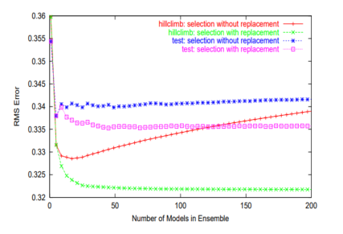

# 集成学习


<!-- @import "[TOC]" {cmd="toc" depthFrom=1 depthTo=6 orderedList=false} -->

<!-- code_chunk_output -->

- [集成学习](#集成学习)
  - [基本原理](#基本原理)
    - [Ensemble selection](#ensemble-selection)
    - [Stacking (Super learner)](#stacking-super-learner)
    - [参考资料](#参考资料)

<!-- /code_chunk_output -->


## 基本原理
在集成学习中，系统通过组合多个模型而不是使用单个模型，来改善机器学习预测效果。 用多个模型的组合代替单个模型，可以增加最终模型的鲁棒性与改善过拟合现象，且多个模型组合后的预测效果通常优于单个模型的预测效果。在集成学习中，各个模型的权重计算主要有以下四种方法，贝叶斯优化（Bayesian optimization），stacking，gradient-free numerical optimization，和ensemble selection。其中**stacking**和**ensemble selection**主要被广泛应用，以下重点介绍stacking与ensemble selection方法。

### Ensemble selection 


Ensemble selection是一种基于**贪心学习**的集成学习方法，其具体步骤如下：
1. 初始化一个空的ensemble；
2. 根据设定的评价指标，将在验证集（validation set或hillclimb）上评价指标最优的模型加入到ensemble中；
3. 重复步骤2，直到到达设定的迭代次数，或所有模型均被使用；
4. 返回在验证集上基于目标评价指标上最优的ensemble。
Ensemble selection在加入模型时，模型的权重为1，在添加模型时，允许重复。

### Stacking (Super learner)
Stacking (或者Super learner)是基于交叉验证的方法集成多个模型，具体步骤如下：
定义待选模型库为$L$，模型库中包含模型的数量为$K(n)$，
1. 在完整的数据集上训练模型库中的每一个模型，数据集$X={X_i:i=1,...n}$, 模型$k$, $k=1,...,K(n)$；
2. （基于交叉验证分割训练集与测试集） 将完成数据集平均分为$V$份，设置第$v$组数据为验证集，$v=1,...V$，剩余数据为训练集；则$T(V)$为第$v$个训练数据集，$V(v)$为对应的验证集；
3. 在以上$V$组训练集与验证集分别训练与验证各个模型，保存各个模型在对应验证集上的预测值，
```math
\hat\Psi_{k,T(V)}(W_i), X_i \in V(v)~\text{for}~ v = 1, ... V 
```
4. 将以上利用不同模型基于不同训练与测试集组合得到的预测值创建为一个 $V \times K$大小的矩阵，
```math
Z = {\hat{\Psi}_{k,T(v)}(W_{V(v)}),v = 1,..., V ~\& ~k = 1, ..., K}
```
5. 在其中一个交叉验证验证集中，模型权重向量为$\alpha$, 计算基于该权重，各个模型的预测值之和，
```math
m(z|\alpha) = \sum^K_{k=1}\alpha_k \hat\Psi_{k,T(v)}(W_V(v)), \alpha_k \geq 0, \sum_{k=1}^{K}\alpha_k = 1 
```
6. 计算在所有交叉验证集中，各个模型的预测值与真实值之间的均方误差，并求解模型权重向量$\alpha$，使得均方误差值最小，
```math
\hat{\alpha} = \text{arg}\min_{\alpha} \sum_{i=1}^{V}(Y_i - m(z_i|\alpha))^2
```


### 参考资料
- [What is Bagging vs Boosting in Machine Learning?](https://www.projectpro.io/article/bagging-vs-boosting-in-machine-learning/579#mcetoc_1fvcc9ijdb)
- [集成学习](https://zhuanlan.zhihu.com/p/105038453)
- [Ensemble selection](https://dl.acm.org/doi/abs/10.1145/1015330.1015432)
- [Stacking](https://www.researchgate.net/publication/222467943_Stacked_Generalization)
- [Super learner](https://biostats.bepress.com/ucbbiostat/paper266/#:~:text=The%20super%20learner%20is%20a%20prediction%20method%20designed,prediction%20algorithms%20to%20be%20considered%20for%20the%20ensemble.)